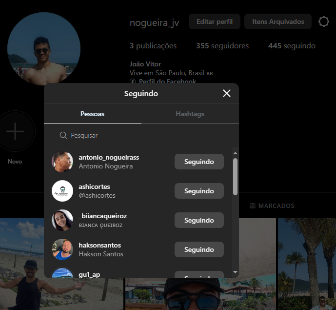
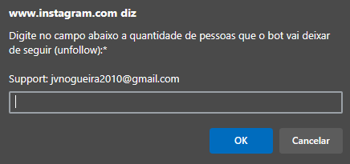

# Instagram Unfollow Bot

Desenvolvimento de bot personalizado para deixar de seguir automaticamente na plataforma do instagram, tendo a funcionalidade de definir quais perfis para o bot permanecer seguindo e o limite de perfis para o bot deixar de seguir. Não há necessidade de conhecimento em programação para o download da extensão e ativação do bot

## Funcionamento

### Instalação e configuração da extensão
1. Copiar a pasta do repositório remoto para o repositório local (git clone https://github.com/jv-nogueira/instagramUnfollowBot.git)
2. Acessar o seu navegador e clicar em 'Gerenciar extensões'. Habilitar o 'Modo do desenvolvedor' (no meu caso, utilizei o navegador Edge)
3. Clicar em 'Carregar sem pacote' e em seguida abrir a pasta do repositório local
4. Verificar se a extensão 'instagramUnfollow' está habilitada (conforme a imagem abaixo)

### Configuração do bot no instagram
1. Abrir o instagram e atualizar a página, clicando na tecla 'F5' localizada na parte superior do teclado
2. Na aba do perfil do instagram, clicar em 'Seguindo' ou 'Seguidores' (conforme a imagem abaixo)
3. Após a página estar totalmente carregada, clique na tecla 'F2'
4. Ao abrir a mensagem de pop-up (conforme a imagem abaixo), insira a quantidade de seguidores que o bot vai 'Deixar de seguir' ou 'Remover' e clique em 'Ok' ou aperte 'Enter'
5. Insira quais usernames para o bot evitar e clique em 'Ok' ou aperte 'Enter'. Uma dica para ajudar na organização dos usernames, utilizar o bot que pega todos os usernames que o perfil do instagram está seguindo para colocar em uma planilha, segue o link do projeto: [www.github.com/jv-nogueira/getInstagramUsernameAll.com](https://github.com/jv-nogueira/getInstagramUsernameAll.git)
6. O bot vai parar o funcionamento automaticamente nesses casos: ao atingir o limite de usernames que deixou de seguir ou removeu, quando sair da tela de funcionamento ou quando o bot percorrer todos os perfis. O bot vai voltar a funcionar quando clicar em 'F2' novamente
7. Ao atingir o limite de usernames, então vai aparecer a mensagem em pop-up perguntando se deseja realizar o download do arquivo (listaUnfollow.txt) que contêm o nome e username que o bot deixou de seguir ou removeu. É uma ótima maneira para revisar os perfis. Para quem quer algo ainda mais organizado, o bloco de notas em txt já vai estar com os dados espaçados, permitindo que ao copiar e colar em uma planilha fiquem organizados em colunas "Nome" e "Username"
8. Não há necessidade de utilizar o editor de código para configurar o bot, mas quem estiver interessado em contribuir realizando implementações, fique a vontade. Não se esqueça de dar uma estrela ao projeto

  
  

## Observações

- O grupo Meta (facebook, instagram, whatsapp, messenger, etc.) tem restrições com o uso de bots, então use por conta e risco. Uma recomendação seria evitar deixar de seguir muitas pessoas na mesma hora
- O bot foi criado com o objetivo de diminuir as ações manuais, melhorar a organização e aumentar o tempo livre. Ou seja, sem objetivos maliciosos
- Deixe a página do instagram ativa enquanto o bot estiver em funcionamento, pois caso contrário, o bot pode não funcionar corretamente
- Não tem problema desligar o monitor enquanto o bot estiver em funcionamento, mas configure a economia de energia do seu PC para que a CPU não desligue sozinha por inatividade
- O bot foi testado em um sistema operacional Windows 10 Pro
- O idioma do instagram que o bot foi testado é o Português (Brasil). O bot pode não funcionar corretamente em outro idioma

## Contato

- E-mail: [jvnogueira2010@gmail.com](mailto:jvnogueira2010@gmail.com)
- LinkedIn: [www.linkedin.com/in/nogueira-jv](https://www.linkedin.com/in/nogueira-jv)
- GitHub: [www.github.com/jv-nogueira](https://github.com/jv-nogueira)