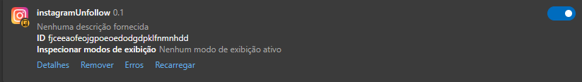

# Instagram Unfollow Bot

Desenvolvimento de bot personalizado para deixar de seguir automaticamente no Instagram, com exceção dos usernames que definir para permanecer seguindo

## Funcionamento

1. Copiar a pasta do repositório remoto para o repositório local
2. Acessar o seu navegador e clicar em 'Gerenciar extensões'. Habilitar o 'Modo do desenvolvedor' (no meu caso, utilizei o navegador Edge)
3. Clicar em 'Carregar sem pacote' e abrir a pasta do repositório local
4. Verificar se a extensão 'instagramUnfollow' está habilitada (conforme a imagem abaixo)
5. Abrir o Instagram e clicar em 'F5' para atualizar a página. Em seguida, na aba do perfil clicar em 'Seguindo'. Desça a barra de rolagem ao máximo que puder para o bot "visualizar" os usernames que vai deixar de seguir
6. Clique na tecla 'F2' do teclado localizada na parte superior
7. Ao abrir a mensagem em pop-up, clique em 'Ok' para o bot começar a funcionar
8. Para o bot parar de funcionar, atualize a página dando 'F5' ou aguarde até chegar ao limite do contador em que apresentará um pop-up
9. Para configurar as pessoas que o bot não vai deixar de seguir, abra o arquivo 'content.js' no editor de código da sua preferência (ou 'Bloco de notas')
10. Procure pela váriavel 'usernamesPermitidos' e inclua dentro do colchete o username das pessoas que o bot vai ignorar, ou seja, vai continuar seguindo
11. Em 'contadorUnfollow', defina o limite de contas que o bot vai deixar de seguir
12. Salve o arquivo e clique em 'Recarregar' na extensão do navegador
13. Atualize a página do Instagram e pronto. O bot está atualizado.

## Observação

- O grupo Meta (Facebook, Instagram e Whatsapp) tem restrições com o uso de bots, então procure evitar deixar de seguir muitas pessoas na mesma hora
- Deixe a página do instagram aberta enquanto o bot está sendo executado, pois caso contrário, o bot pode não funcionar bem
- O bot foi testado em um sistema operacional Windows 10 Pro

## Contato

- E-mail: [jvnogueira2010@gmail.com](mailto:jvnogueira2010@gmail.com)
- LinkedIn: [www.linkedin.com/in/nogueira-jv](https://www.linkedin.com/in/nogueira-jv)
- GitHub: [www.github.com/jv-nogueira](https://github.com/jv-nogueira)